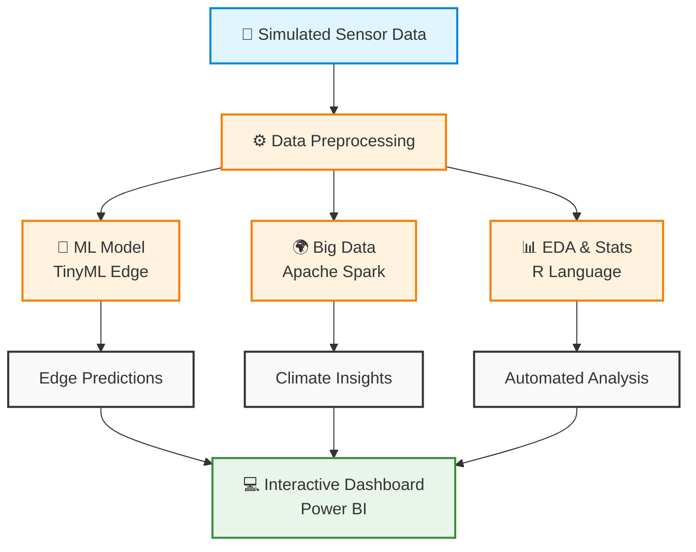
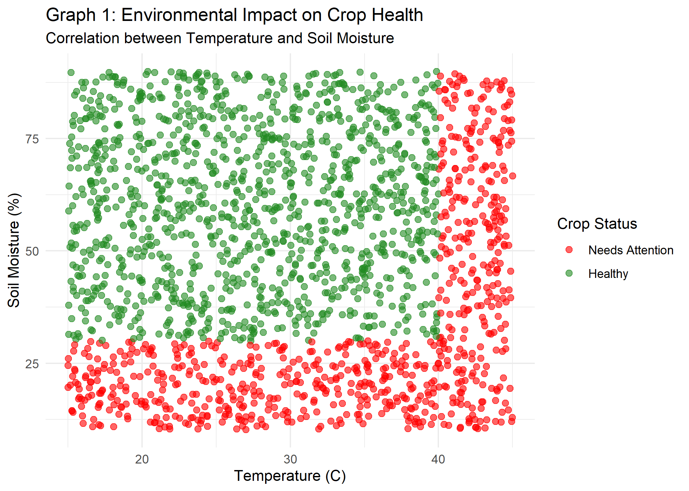
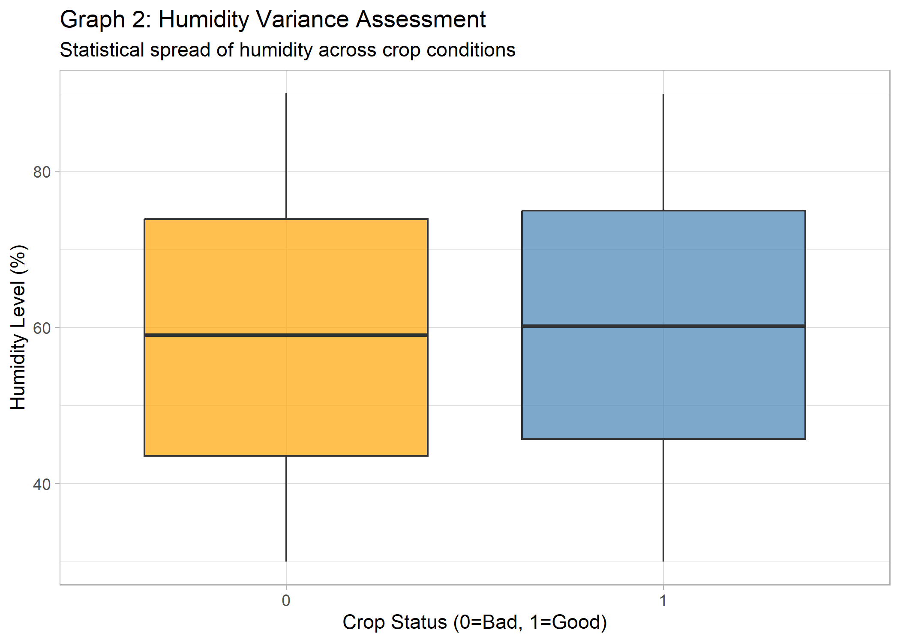

# 🌱 Smart Agriculture Edge AI Platform (WIP)

## 🚀 Overview
An end-to-end IoT + Edge AI system that predicts crop health using environmental data and processes large-scale climate datasets using PySpark.

## ⚙️ Tech Stack
- Python, PySpark  
- TensorFlow Lite (TinyML)  
- R (EDA)  
- Power BI  
- GitHub Actions (CI/CD)

## 📊 Key Highlights
- Processed 100,000+ climate records  
- Built edge-level ML prediction system  
- Designed interactive dashboard for insights  

## 🚧 Status
This project is currently under development and being actively improved.

## 🏗️ System Architecture
- This diagram shows the end-to-end pipeline from sensor data collection to final dashboard insights.

    
1. **IoT Edge Simulation:** Generated synthetic sensor data (Soil Moisture, Temp, pH) and deployed a quantized `TinyML` neural network to simulate real-time edge predictions.
2. **Automated Data Processing:** Engineered a pipeline that triggers R scripts to clean data and generate statistical distributions (Scatter, Boxplots, Density).
3. **Interactive Dashboard:** Built a Power BI dashboard with dynamic filtering to provide farmers with real-time KPI gauges and crop health ratios.
4. **Distributed Big Data:** Utilized Apache Spark to process a massive historical climate dataset (100,000+ rows), grouping data across farm regions to detect extreme weather anomalies.
5. **CI/CD Pipeline:** Developed an automated DevOps orchestrator (`devops_pipeline.py`) and a GitHub Actions `.yml` workflow to automatically test, build, and deploy the AI model to production without human intervention.

## 📸 Sample Outputs

## 👨‍💻 How to Run
Run the master DevOps pipeline to execute all stages automatically:
`python src/devops_pipeline.py`